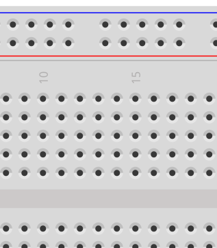
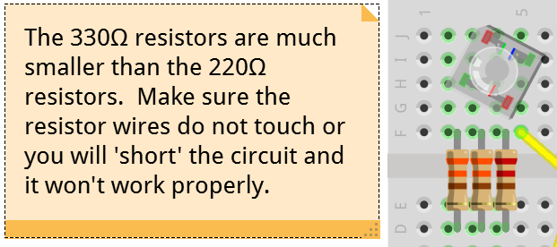
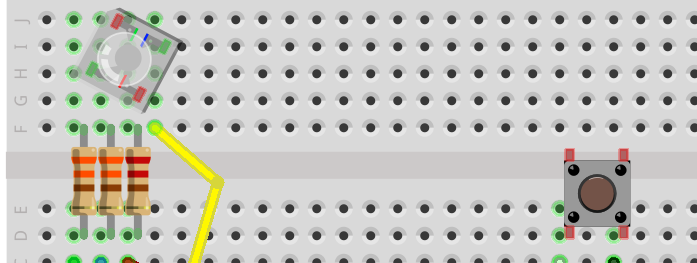
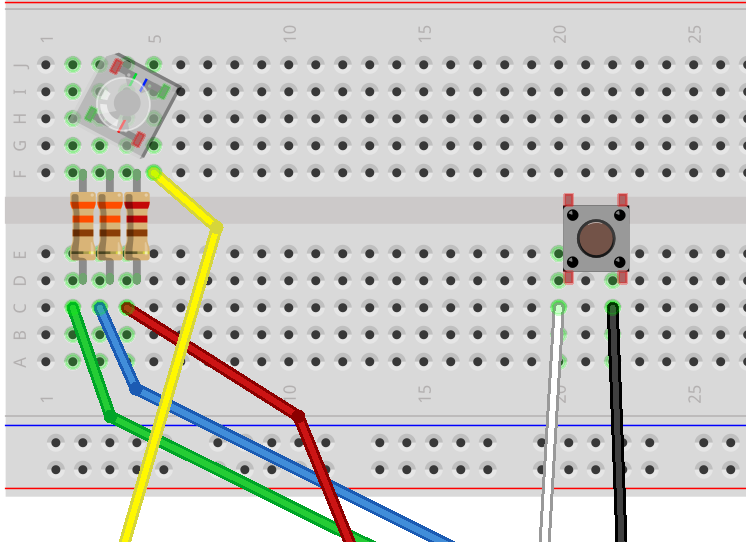
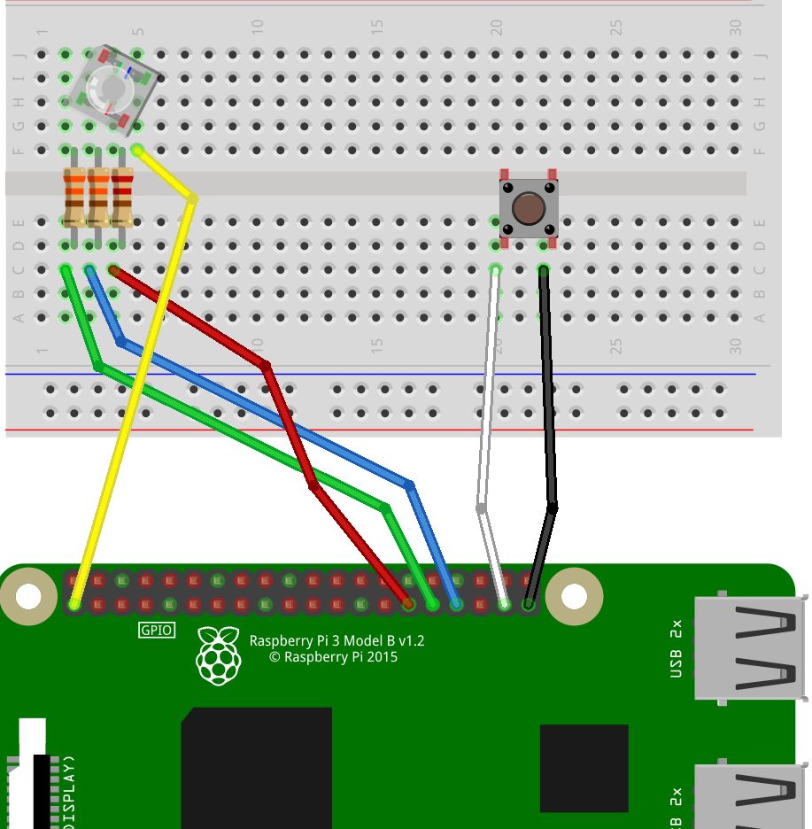

# That Pi Hunt
### That Conference 2016

## Intro
In this lab / activity, you will be using a [Raspberry Pi computer](http://www.raspberrypi.org), running
[Windows IoT Core](https://developer.microsoft.com/en-us/windows/iot), and some electronic components to 
build a Bluetooth LE Beacon detector.  As part of this process, you will be using Visual Studio 2015, 
running on Windows 10 to load a Universal Windows Platform application to the Raspberry Pi.

## Getting Started - Choose your Path
If you haven't already, stop up at the check-in table and get a hardware kit.  If you didn't bring your
own Raspberry Pi computer, you may need to sign up on the waiting list, since there are a limited number
of loaner Raspberry Pi computers available.  If you're on the waiting list, you can take that time to try
out some of the other kits/projects in the lab, or if you want to get started anyway, we'd suggest you 
start with the 'Software Geek' path.

[I'm a Hardware Geek](#hardware) -- [I'm a Software Geek](#software)

<a name="hardware" />
## Building the Hardware
Take a moment to review the supplies you received.  You should have the following parts:

* 1 - 220Ω Resistor [larger] (red, red, brown, gold)
* 2 - 330Ω Resistors [smaller] (orange, orange, brown, gold)
* 1 - Push Button Switch
* 1 - RGB Led
* 6 - Male - Female Jumper Wires (various colors)
* 1 - Half-size prototyping breadboard
* (optional) 1 - MicroSD card with a bootable Windows 10 IoT image

If you're missing any of the above components, please head back up to the check-out table and someone will
help you find the missing pieces.  If you have any questions on which component is which, the steps below
should call out the components as images.  If you still have questions, please raise your hand and a camp
counselor will stop around and help you out.

You'll start this process with the breadboard laid out table, with the side with holes facing upwards:



### Setting up the LED
For this exercise, we'll be preparing the LED to connect to the Raspberry Pi.  Start by inserting your LED
into the breadboard.  You want to push the LED into the board in a way that each pin of the LED connects to
a unique 'lane' on the breadboard.  The breadboard you're working with has 5 holes in each 'lane':


When you place the LED into the board, make sure the 'cutoff' corner is pointing 'upward' or 'away from you'
when you look at the breadboard laying on the table.  This will cause the right-most lane to tie to the power
source from the Raspberry Pi when we get there, and will line up the RGB legs correctly for the remainder of
the wiring.

### Adding the Resistors
This particular LED has an approximate ratio of 2/3/3 for R/G/B in the amount of voltage that is available 
across the three LED diodes.  We're going to use the 220Ω and 330Ω resistors to compensate so each LED diode
shine at about the same level.  Tie the 220Ω resistor to the Red leg (the left-most lane), and the two 330Ω
resistors to the center two lanes by inserting one end of the resistor into the lowest hole in the lane, and
jumping across the gap to the corresponding lane.



### Adding the Push Button
The push buttons we're using for this project have 4 'legs'.  When connecting the push button, you may find it
easiest to insert two of the legs into the lower 'bank' of lanes on the breadboard, with the other two pins landing
in the 'gap' in the breadboard.  When choosing which two lanes to insert into the breadboard, make sure to pick
legs that emerge from the same 'side' of the push button.



### Add the Wires
Now that the primary components are on the board, it's time to add some wires to connect the board to the Raspberry
Pi computer.  The wire colors in the image below are just an example, your kit may have different colored wires, so
if you'd like, take a minute to write down a cross-reference between the wire colors you have and the ones in the
picture.  When inserting the wires into the board, use the male end of the wire and insert it into the corresponding
hole in the breadboard.  This should leave the female end of the wire hanging free, to be connected to the Pi in the
next step.



### Add the Raspberry Pi
Before we see a picture of the circuit, let's take a look at the pins on the Raspberry Pi (when viewing the Pi
with the GPIO pinouts on top):


([image courtesy of raspberrypi.org](https://www.raspberrypi.org/documentation/usage/gpio-plus-and-raspi2/), via [Creative Commons License](https://www.raspberrypi.org/creative-commons/))

For this step, the diagram will use GPIO pins 5,6,13 and 26 (you are free to use other GPIO pins, just remember to
write down which ones, because you'll need the pin numbers for the coding side).  We'll also be using the 3.3v
power source and ground pins (again, the diagrams use the lower right pin for ground, and and lower left pin for 3.3v).


### Hardware - Achievement Unlocked!



Now that you have the hardware assembled, it's time to move on to the software side, so get your Visual Studio ready baby!

<a name="software" />
## About the Software
No IoT solution would be complete without a software component.  Whether that is through
firmware burned onto a chip, or software loaded into a devices' storage / memory, software
is what links the hardware with the rest of the internet.  For this project, we'll be adapting
a pre-built piece of software to match with how we configured [or will configure for you Software 
Geeks] our Raspberry Pi and hardware kit.

The software does a few things:

* It encodes the 'map' that represents the physical world into something the software can use
* It utilizes the Bluetooth LE hardware of your Raspberry Pi to detect beacons
* It indicates to the user (via the LED) how close the beacon of interest is
* It accepts input from the user to register visiting a beacon (via the push button)

As a software geek, you can choose how much control you want to take from the program.  You
can decide to change how the software finds beacons, or how it translates the beacon signals
into physical output for the user to see / hear.  By default, the software will do the following:

* When started, the application loads the map and begins scanning for beacons
* A beacon is selected (randomly) as the current target beacon
* When a beacon is found, the LED blinks Blue if tracking against a non-target beacon, and Green if tracking against the target beacon
* The LED blinks faster the closer you move to the target
* When the Raspberry Pi is within capture distance of the beacon, the LED begins a rainbow light cycle
* When the LED has 'gone rainbow', clicking the push button captures the current target and selects a new target from the map
* Once 10 targets are captured, the LED shuts off, indicating your quest is complete, return to the check-in table for more info!

### Getting the Software
Go to (https://github.com/bengavin/that-conference-2016/tree/pihunt) and click 'Open in Visual 
Studio'.  This will pull the code onto your local computer, and give you the opportunity to open the
'ThatPiHunt' solution.


```
NOTE: You may need to setup a 'repository' for the software on the local computer.  This is just
a special directory on your computer where the code will be placed (e.g. C:\Source\ThatRepo).  Go
ahead and create one and when Visual Studio asks, just select the directory that you created.
```

### Opening the Solution
Now, from Visual Studio, open the 'ThatPiHunt.sln' file, this will open the solution on your
computer and you will see something that looks like this:


* The 'Assets' folder contains images that are used by the application during runtime, these
can be safely ignored, as we're not interested in what the application itself looks like right now.

* The 'Domain' folder contains classes that define the application's view of the Map, Contestant (you)
and PointOfInterest (a beacon).  These classes likely won't need any changes.

* The 'Services' folder contains the bulk of the program logic.  If you're going to make changes
to the program, it's likely that they'll need to be made here.

  * The 'BeaconService' class handles keeping track of the beacons, unless you want to get way
    down in the weeds, you probably don't need to worry about much in here.

  * The 'GameService' class handles the game loop, and gathering data from and sending control messages
    to other services in the application.  Generally in response to your movement in relation to the beacons.

  * The 'LedService' class controls the LEDs, this is where you'll change what pin you plugged your LED
    hardware into (see the const(s) at the top of the file).

  * The 'PushButtonService' class controls the push button and records events from the button.  This is where
    you'll need to update if you used a different pin for the button (see the const(s) at the top of the file).

* The 'Views' folder contains the main user interface for the program.  We don't need to worry about
this right now, as your Raspberry Pi isn't hooked up to a monitor, so there's nothing to see.

### Taking a Hardware Break
If you're a 'Software Geek' and have not yet assembled your hardware, now is the time to do it.  Your
code won't run without the Raspberry Pi, and it won't do anything interesting if you don't have the hardware
hooked up to the Pi, so do that quick and stop back down here when you're ready.

[Be a Hardware Geek](#hardware)

### Making your Changes and Running the Code
As you look through the code, there are various comments (indicated by '//' or '/* ... */') that talk about
where changes can be made (or need to be made, depending on your hardware setup).  Once you've made sure
you're talking to the right pins for the LED/Push Button, you're ready to 'deploy' your code to the
Raspberry Pi.  Raise your hand and a lab counselor will stop over and help you with this step.  It involves
hooking your Raspberry Pi up to a network wire and setting up Visual Studio to talk with it.

Once your code is running, go capture the beacon in the corner of the room to test that your setup is working
properly.  Once that's working, you're off to the races, see you when you return!

Oh, and 'Good Luck'!
