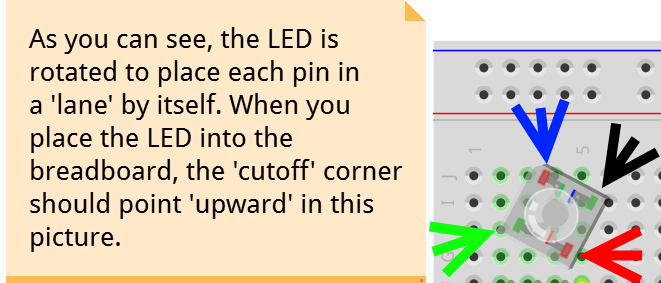

# That Pi Hunt
### That Conference 2016

## Intro
In this lab / activity, you will be using a [Raspberry Pi computer](http://www.raspberrypi.org), running
[Windows IoT Core](https://developer.microsoft.com/en-us/windows/iot), and some electronic components to 
build a Bluetooth LE Beacon detector.  As part of this process, you will be using Visual Studio 2015, 
running on Windows 10 to load a Universal Windows Platform application to the Raspberry Pi.

## Getting Started - Choose your Path
If you haven't already, stop up at the check-in table and get a hardware kit.  If you didn't bring your
own Raspberry Pi computer, you may need to sign up on the waiting list, since there are a limited number
of loaner Raspberry Pi computers available.  If you're on the waiting list, you can take that time to try
out some of the other kits/projects in the lab, or if you want to get started anyway, we'd suggest you 
start with the 'Software Geek' path.

[I'm a Hardware Geek](#hardware) -- [I'm a Software Geek](#software)

<a name="hardware" />
## Building the Hardware
Take a moment to review the supplies you received.  You should have the following parts:

* 1 - 220Ω Resistor (red, red, brown, gold)
* 2 - 330Ω Resistors (orange, orange, brown, gold)
* 1 - Push Button Switch
* 1 - RGB Led
* 6 - Male - Female Jumper Wires
* 1 - Half-size prototyping breadboard
* (optional) 1 - MicroSD card with a bootable Windows 10 IoT image

If you're missing any of the above components, please head back up to the check-out table and someone will
help you find the missing pieces.  If you have any questions on which component is which, the steps below
should call out the components as images.  If you still have questions, please raise your hand and a camp
counselor will stop around and help you out.

You'll start this process with the breadboard laid out table, with the side with holes facing upwards:

### Setting up the LED
For this exercise, we'll be preparing the LED to connect to the Raspberry Pi.  Start by inserting your LED
into the breadboard.  You want to push the LED into the board in a way that each pin of the LED connects to
a unique 'lane' on the breadboard.  The breadboard you're working with has 5 holes in each 'lane':

When you place the LED into the board, make sure the 'cutoff' corner is pointing 'upward' or 'away from you'
when you look at the breadboard laying on the table.  This will cause the right-most lane to tie to the power
source from the Raspberry Pi when we get there, and will line up the RGB legs correctly for the remainder of
the wiring.

### Adding the Resistors
This particular LED has an approximate ratio of 2/3/3 for R/G/B in the amount of voltage that is available 
across the three LED diodes.  We're going to use the 220Ω and 330Ω resistors to compensate so each LED diode
shine at about the same level.  Tie the 220Ω resistor to the Red leg (the left-most lane), and the two 330Ω
resistors to the center two lanes by inserting one end of the resistor into the lowest hole in the lane, and
jumping across the gap to the corresponding lane.

### Adding the Push Button
The push buttons we're using for this project have 4 'legs'.  When connecting the push button, you may find it
easiest to insert two of the legs into the lower 'bank' of lanes on the breadboard, with the other two pins landing
in the 'gap' in the breadboard.  When choosing which two lanes to insert into the breadboard, make sure to pick
legs that emerge from the same 'side' of the push button.

### Add the Wires
Now that the primary components are on the board, it's time to add some wires to connect the board to the Raspberry
Pi computer.  The wire colors in the image below are just an example, your kit may have different colored wires, so
if you'd like, take a minute to write down a cross-reference between the wire colors you have and the ones in the
picture.  When inserting the wires into the board, use the male end of the wire and insert it into the corresponding
hole in the breadboard.  This should leave the female end of the wire hanging free, to be connected to the Pi in the
next step.

### Add the Raspberry Pi
Before we see a picture of the circuit, let's take a look at the pins on the Raspberry Pi (when viewing the Pi
with the GPIO pinouts on top):

([image courtesy of raspberrypi.org](https://www.raspberrypi.org/documentation/usage/gpio-plus-and-raspi2/), via [Creative Commons License](https://www.raspberrypi.org/creative-commons/))

For this step, the diagram will use GPIO pins 5,6,13 and 26 (you are free to use other GPIO pins, just remember to
write down which ones, because you'll need the pin numbers for the coding side).  We'll also be using the 3.3v
power source and ground pins (again, the diagrams use the lower right pin for ground, and and lower left pin for 3.3v).

### Hardware - Achievement Unlocked!

Now that you have the hardware assembled, it's time to move on to the software side, so get your Visual Studio ready baby!

<a name="software" />
